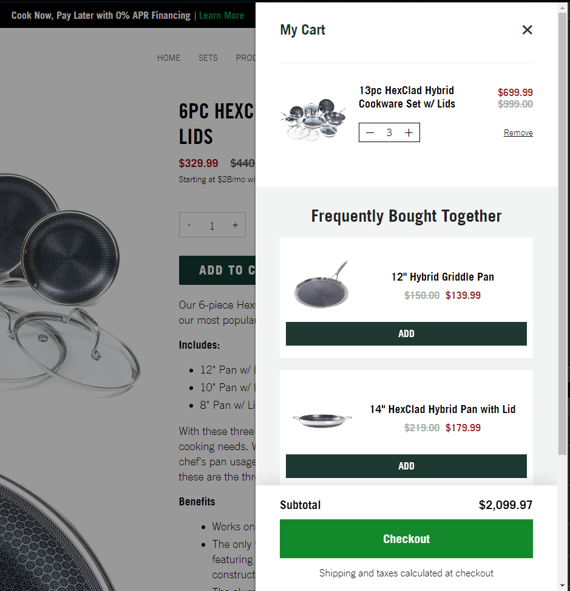

# Shopify Cart Drawer

This is a cart drawer component for shopify which leverages the section rendering api, built in vanilla js/css for maximum port-ability.

## Installation

Paste the javascript into the theme's main js file or format file to work within a react framework.
Paste the css into the theme's main css file.
Paste the `cart-drawer.liquid` section into the theme's `sections` folder.

Import the section in the `theme.liquid` file like so

`

`

Add an open trigger to an element using the data attribute `data-cart-drawer-open`
## Usage/Examples

Opening the drawer
`<button data-cart-drawer-open> Open Me </button>`

Adding a product then opening the drawer
`<button data-cart-drawer-add="{{ product.variants.first.id }}"> Add To Cart </button>`

### Events
If you need to do an action on cart open/close you can listen to the following events
`cartDrawer:open`
`cartDrawer:close`

